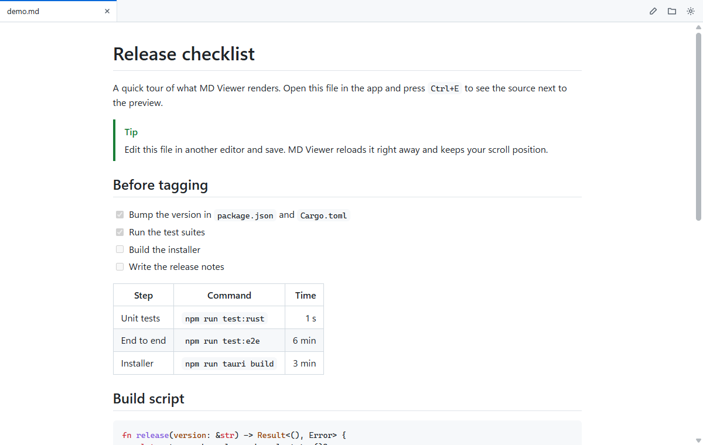
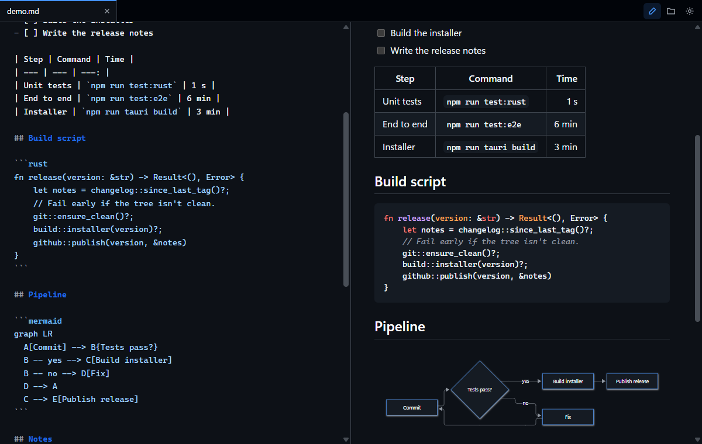

# MD Viewer

A small, fast markdown viewer and editor for Windows, built with Tauri 2.



Markdown is parsed and highlighted in Rust (comrak and syntect), and the UI is plain TypeScript with no framework. The editor (CodeMirror) and diagram support (Mermaid) only load when a document needs them, so opening a file to read it stays quick. A 20 KB README opens in about 430 ms from a cold start, and in under 50 ms when the app is already running.

## Download

Get the installer from the [latest release](https://github.com/CollinOS/md-viewer/releases/latest) and run it. It installs for your user account only, so it doesn't need admin rights. It runs on Windows 10 and 11, and if your machine doesn't have the WebView2 runtime (Windows 11 always does), the installer downloads it.

Two things to know on first run:

- **SmartScreen warning.** The installer isn't code-signed, so Windows may say "Windows protected your PC". Click **More info**, then **Run anyway**.
- **Default app for `.md` files.** If you haven't chosen a default app for `.md` files, the installer makes MD Viewer the default. If you have, Windows keeps your choice. To switch later, right-click a `.md` file, pick **Open with**, choose MD Viewer or another app, and tick **Always**.

To uninstall, use **Settings > Apps > Installed apps**.

## Features

- GitHub-flavored markdown: tables, task lists, footnotes, alerts, heading anchors, raw HTML
- Syntax highlighting for a few hundred languages, colored by the active theme
- Mermaid diagrams that follow the color scheme
- Tabs, plus multiple windows (`Ctrl+Shift+N`)
- Auto-reload when a file changes on disk, keeping your scroll position
- Split-view editing with live preview (`Ctrl+E`) and `Ctrl+S` to save
- Saves keep the file's original encoding (UTF-8, UTF-8 with BOM, UTF-16, Windows-1252) and line endings
- Eight color schemes, separate picks for light and dark mode, adjustable accent, font and width
- Double-clicking a `.md` file while the app is open adds a tab to the existing window
- Optional "stay ready in the background" setting, so files open almost instantly after the last window is closed



Try it on [`docs/demo.md`](docs/demo.md), which touches most of the features.

## Keyboard shortcuts

| Keys | Action |
| --- | --- |
| `Ctrl+O` | Open files |
| `Ctrl+E` | Toggle editing |
| `Ctrl+S` | Save |
| `Ctrl+W` | Close tab |
| `Ctrl+Shift+T` | Reopen closed tab |
| `Ctrl+Tab` / `Ctrl+Shift+Tab` | Next / previous tab |
| `Ctrl+1` ... `Ctrl+9` | Jump to tab (9 is the last one) |
| `Ctrl+Shift+N` | New window |
| `Ctrl+,` | Settings |
| `Ctrl+Plus` / `Ctrl+Minus` / `Ctrl+0` | Font size |
| `Ctrl+F` (in the editor) | Find and replace |

Middle-click closes a tab, and tabs can be dragged to reorder them.

## Building from source

Requirements: Rust (stable), Node 20+, and the MSVC C++ build tools (the "Desktop development with C++" workload, or `winget install Microsoft.VisualStudio.BuildTools` with the VC tools).

```
npm install
npm run tauri dev          # development, with hot reload for the frontend
npm run tauri build        # release build and NSIS installer
```

The installer ends up in `src-tauri/target/release/bundle/nsis/`.

Build from PowerShell or cmd rather than Git Bash. Git Bash ships its own `link.exe`, which shadows the MSVC linker.

To change the app icon, replace `app-icon.png` (a square PNG, 1024 px or larger, with a transparent background) and run `npx tauri icon app-icon.png` before building.

## Tests

```
npm run test:rust          # unit tests for rendering, encodings, saving, settings
npm run build:debug        # debug build with the frontend embedded
npm run test:e2e           # end-to-end suites against that build
```

The end-to-end tests launch the real app with WebView2's remote debugging port open and drive it with Playwright, so they cover the actual Rust and webview behavior rather than a mock. Set `MDV_EXE` to test a different build.

## Performance

`node bench/gen.mjs` creates large test documents in `bench/files`, then `node bench/startup.mjs` measures startup, opening files in a running instance and memory against the release build. Setting `MDV_PERF` to a file path makes the app log timing marks there.

See [`PLAN.md`](PLAN.md) for the targets, the measured numbers and the design decisions behind them.

## License

[MIT](LICENSE)
