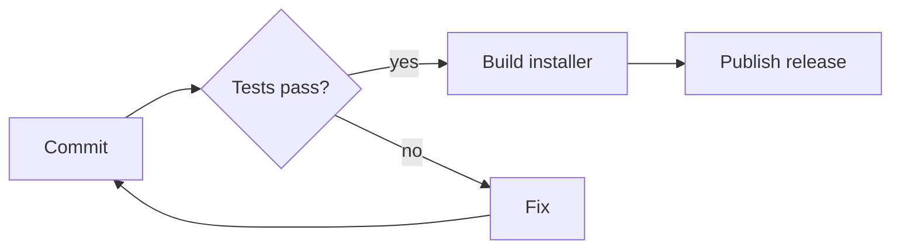

# Release checklist

A quick tour of what MD Viewer renders. Open this file in the app and press `Ctrl+E` to see the source next to the preview.

> [!TIP]
> Edit this file in another editor and save. MD Viewer reloads it right away and keeps your scroll position.

## Before tagging

- [x] Bump the version in `package.json` and `Cargo.toml`
- [x] Run the test suites
- [ ] Build the installer
- [ ] Write the release notes

| Step | Command | Time |
| --- | --- | ---: |
| Unit tests | `npm run test:rust` | 1 s |
| End to end | `npm run test:e2e` | 6 min |
| Installer | `npm run tauri build` | 3 min |

## Build script

```rust
fn release(version: &str) -> Result<(), Error> {
    let notes = changelog::since_last_tag()?;
    // Fail early if the tree isn't clean.
    git::ensure_clean()?;
    build::installer(version)?;
    github::publish(version, &notes)
}
```

## Pipeline



## Notes

Mermaid diagrams, footnotes[^1] and GitHub alerts all follow the color theme, which you can change with `Ctrl+,`.

> [!WARNING]
> The installer isn't code-signed yet, so Windows shows a SmartScreen prompt the first time.

[^1]: Like this one.
