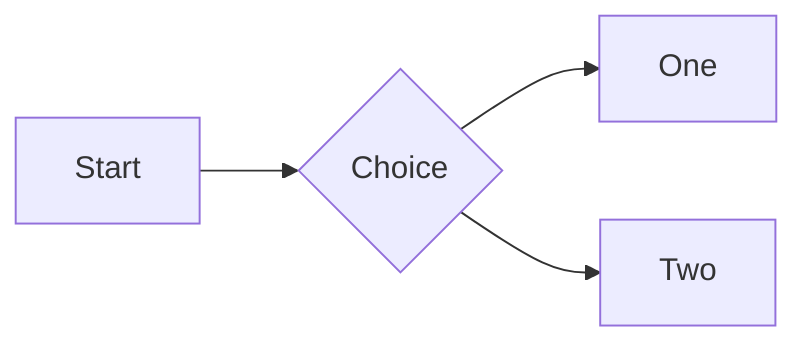

# Sample Document

Intro paragraph with **bold**, *italic*, ~~strike~~, `inline code` and an autolink https://example.com.

## Images

  


## Table

| Name | Value |
|------|------:|
| one  | 1     |
| two  | 2     |

## Tasks

- [x] done item
- [ ] open item

## Code

```rust
fn main() {
    let x = 42; // answer
    println!("{x}");
}
```

```typescript
interface Point { x: number; y: number }
const p: Point = { x: 1, y: 2 };
```

## Alerts

> [!NOTE]
> Useful information.

> [!WARNING]
> Be careful.

## Diagram



## Links

- [Other doc](other.md)
- [Other doc section](other.md#second-section)
- [Jump to tasks](#tasks)
- [External](https://example.com/page)
- [Missing](nope.md)

## Raw HTML

<details><summary>More</summary>

Hidden content.

</details>

<script>window.__pwned = true</script>
<style>body { display: none !important; }</style>


Footnote here.[^1]

[^1]: The footnote text.
